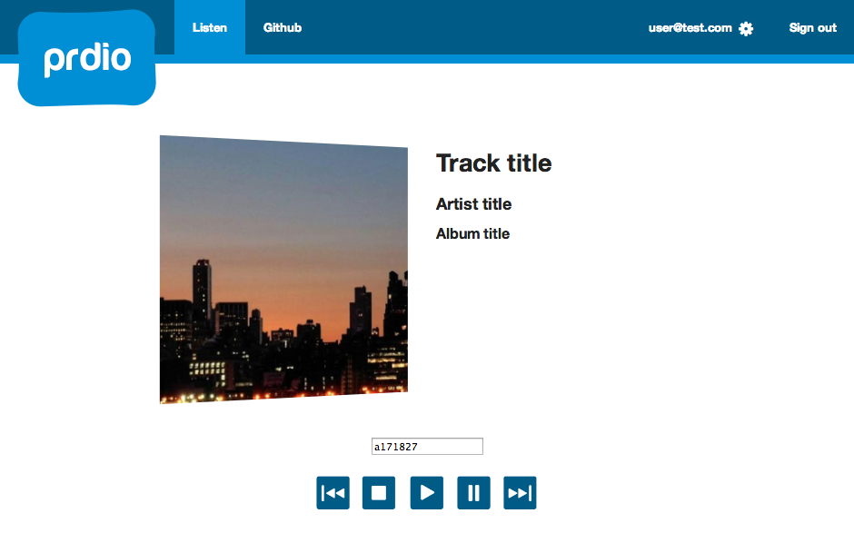

# Prdio

Rdio, reimagined for parties. https://github.com/nelsonmc/prdio-app

Built using Devise starter app (http://github.com/plataformatec/devise) and Hello World for Rdio Playback API (https://github.com/rdio/hello-web-playback/)

## Why Prdio?

Rdio is pretty much amazing - you can define playlists, custom radio stations, and have access to a large amount of music. But when you're playing music for a party, Rdio isn't necessarily the perfect interface. The goal of the Prdio project: to use the Echonest and Rdio APIs to create an app that provides:

* Easy access to the most popular songs. No more "experimenting" with B-sides in Rdio Stations: just the good stuff.
* A highly-simplified interface. People want to be able to add songs to the playlist, but shouldn't be encumbered by a full-feature interface: less is more here. We're here to party, after all.

## Screenshots



## Installation

Install bundler:

```
gem install bundler
```

Install the gems:

```
bundle install
```

This will install Rails 4.0.0, sqlite3 gem and Devise.

Rake devise setup task:

```
rake devise:setup
```

This will:

* drop any existing database
* create a new database
* migrate the database
* create a default user and admin

Run the server and use the credentials provided by the rake task to sign in and test the application.

To allow Rdio playback, you must also add a valid token for your local domain. This can be retrieved here: (http://rdioconsole.appspot.com/#method=getPlaybackToken). Once you have generated a key, it can be added as such:

```
# app/assets/javascripts/token.js

var playback_token = "your_playback_token_here";
var domain = "0.0.0.0";
```
